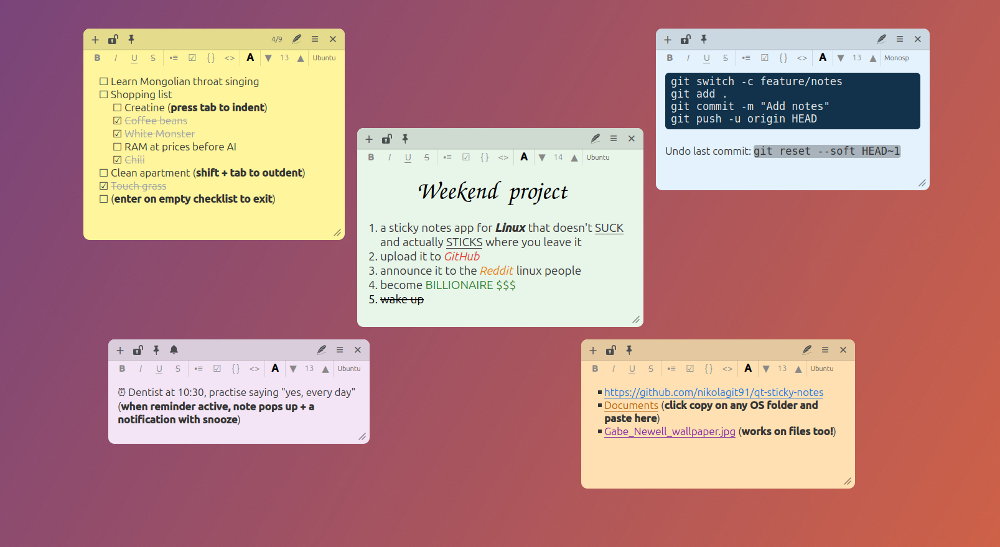
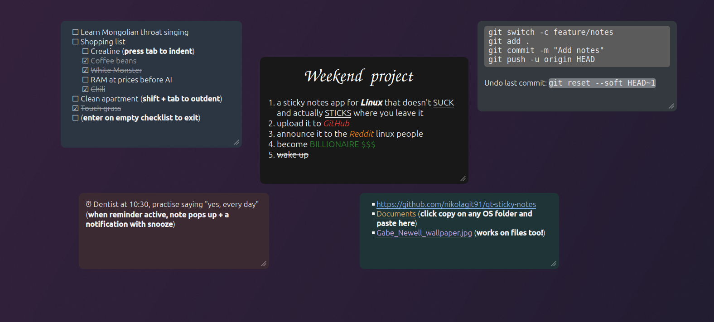
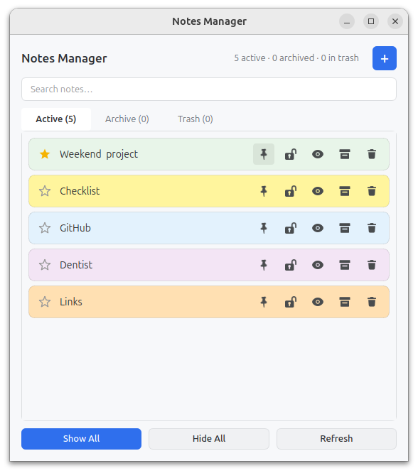
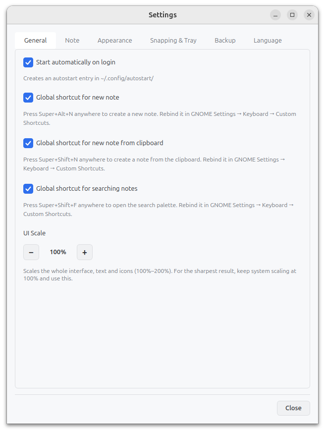
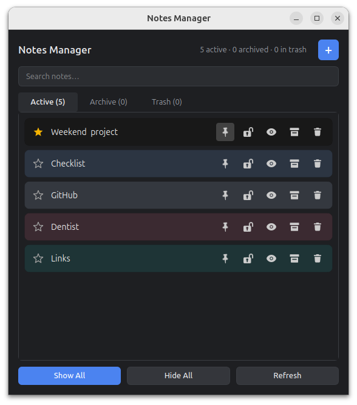
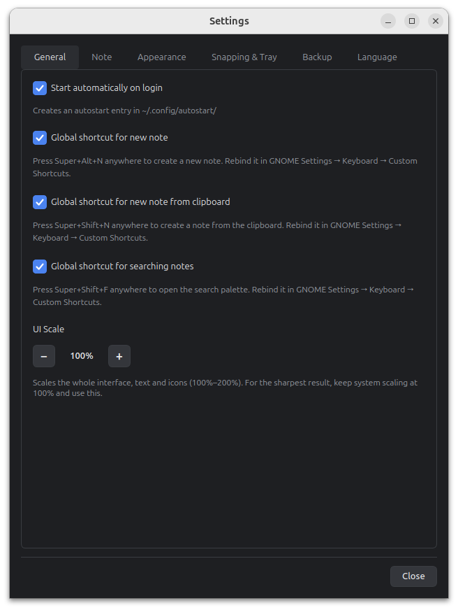
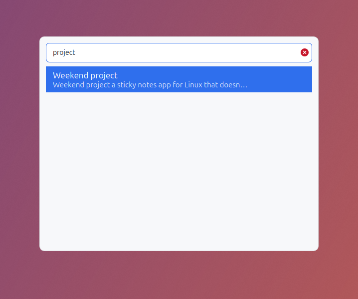
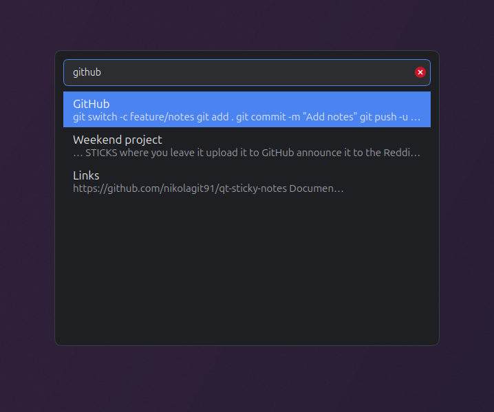
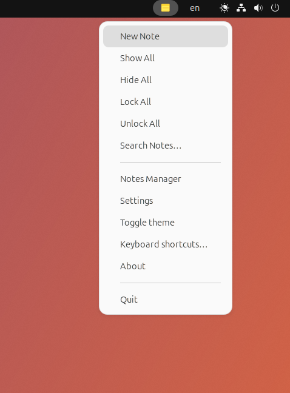

# Sticky Notes

A lightweight sticky notes app for the Ubuntu desktop, built with Python & PyQt6.
Fast, keyboard-friendly, and it stays out of your way — notes live on your
desktop, sync to a tray icon, and survive restarts.



## Features

- **Sticky notes** on your desktop with per-note colours.
- **Themes:** Light, Dark, and Auto (dark on a wall-clock schedule).
- **Rich text:** code blocks and inline code, auto-contrast text.
- **Global shortcuts:** new note, new note from clipboard, and search — from anywhere.
- **Tray icon** as the main entry point (New Note, Show All, Settings, Manager).
- **Autostart** on login (toggleable).
- **Backups:** rotating automatic backups with restore.
- **Reminders** and full-text **search** across all notes.
- **Multilingual UI:** 11 languages — English, Croatian, German, Spanish, French, Russian, Simplified Chinese, Brazilian Portuguese, Italian, Polish, and Japanese.

## Screenshots

**Dark theme** with clean mode — the header and toolbar stay hidden until you hover a note.



**Notes Manager** and **Settings** — light and dark.

<table>
  <tr>
    <td></td>
    <td></td>
  </tr>
  <tr>
    <td></td>
    <td></td>
  </tr>
</table>

**Global search** (`Super+Shift+F`) — finds notes by title or content, from anywhere.

<table>
  <tr>
    <td></td>
    <td></td>
  </tr>
</table>

**Tray menu** — the main entry point. On Ubuntu it works out of the box (the
AppIndicator extension is enabled by default).



## Requirements

- Ubuntu 24.04 LTS (or newer) with GNOME.
- Python 3 (ships with Ubuntu).
- A few system packages (installed by the installer or Step 1 of the manual guide).

> The app intentionally uses **system PyQt6 packages**, not `pip`/venv — a venv
> breaks the tray icon and GTK integration.

## Install

The quickest path, from the folder that contains `install.sh`:

```bash
./install.sh
```

It installs the required packages, copies the app to a stable location
(`~/.local/share/sticky-notes-app`), and launches it once so it registers its
app-menu launcher, autostart entry, and global shortcuts.

For the manual, step-by-step route see **[docs/INSTALL.md](docs/INSTALL.md)**.

## Shortcuts

| Shortcut | Action |
|---|---|
| **Super + Alt + N** | New note |
| **Super + Shift + N** | New note from clipboard |
| **Super + Shift + F** | Search notes |

Press **F1** on a note for the full shortcut list.

## Display scaling

If the app looks blurry, it's usually your desktop's **fractional scaling**
(e.g. 125% / 150%) upscaling the window. For the sharpest result, keep your
**system scaling at 100%** and use the app's own **UI Scale** (Settings → UI
Scale, 100%–200%) instead — it re-renders text and icons crisply at any size.

## License

MIT — see [LICENSE](LICENSE). © 2026 Nikola Javorina.

UI icons are third-party works under their own licences (CC BY / MIT / CC0 /
Public Domain) — see [CREDITS.md](CREDITS.md) for authors and attributions.

## Support

If Sticky Notes is useful to you, you can support development on Ko-fi — it keeps
the app free, ad-free, and improving:

[](https://ko-fi.com/G2A425K6GE)

## Contributing translations

The UI ships in English, Croatian, German, Spanish, French, Russian, Simplified
Chinese, Brazilian Portuguese, Italian, Polish, and Japanese. The non-English
translations are a first pass — corrections and new languages are very welcome.
To improve one, edit the matching dictionary in
[`sticky_notes/i18n.py`](sticky_notes/i18n.py) (the keys are the English source
strings; translate the values) and open a pull request. To add a language, add
its `(code, name)` to `LANGUAGES` and a new dictionary with every key. Chinese
and Japanese require the `fonts-noto-cjk` package to render.
